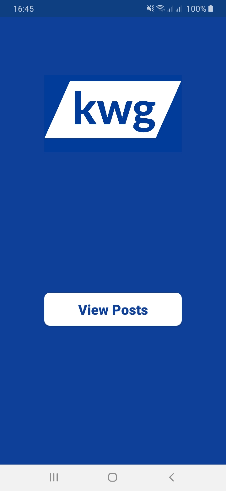
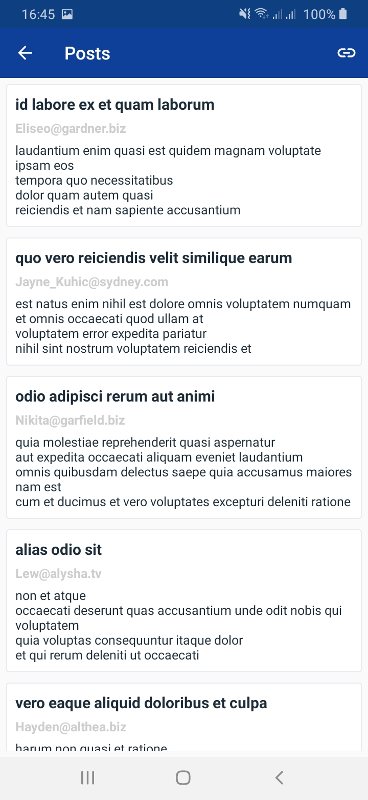
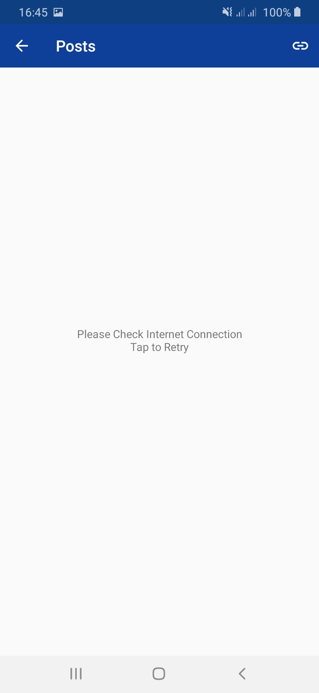
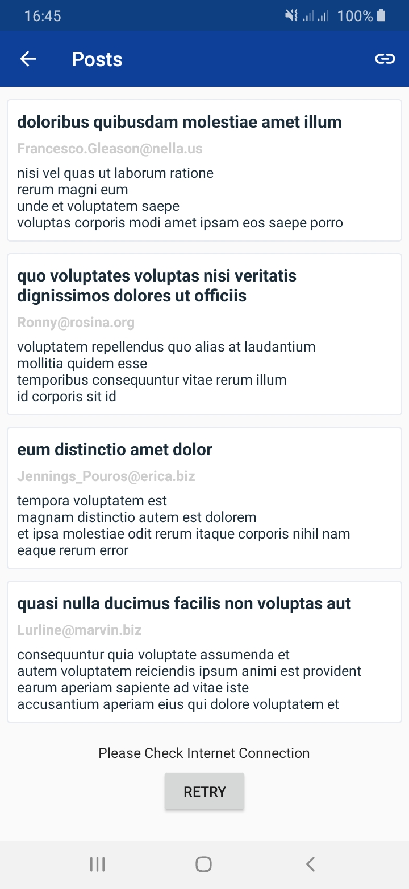

# KWG Assignment

The App uses a set of Android Jetpack libraries plus Retrofit to dispay data from REST API.

### Prerequisites

The project has all required dependencies in the build.gradle file.

## Architecture

The project uses MVVM architecture pattern.

## Libraries 

* [ViewModel](https://developer.android.com/topic/libraries/architecture/viewmodel/) - Manage UI related data in a lifecycle conscious way and act as a channel between use cases and ui
* [DataBinding](https://developer.android.com/topic/libraries/data-binding) - support library that allows binding of UI components in layouts to data sources,binds character details and search results to UI
* [Navigation Component](https://developer.android.com/guide/navigation/navigation-getting-started) - Android Jetpack's Navigation component helps in implementing
navigation between fragments
* [Dagger Hilt](https://developer.android.com/jetpack/androidx/releases/hilt) - For Dependency Injection.
* [Paging 3](https://developer.android.com/topic/libraries/architecture/paging/v3-overview?hl=in) - Allow pagination of the Data.
* [Retrofit](https://square.github.io/retrofit/) - To access the Rest Api

## Screenshots
|||||
|:----:|:----:|:----:|:----:|
